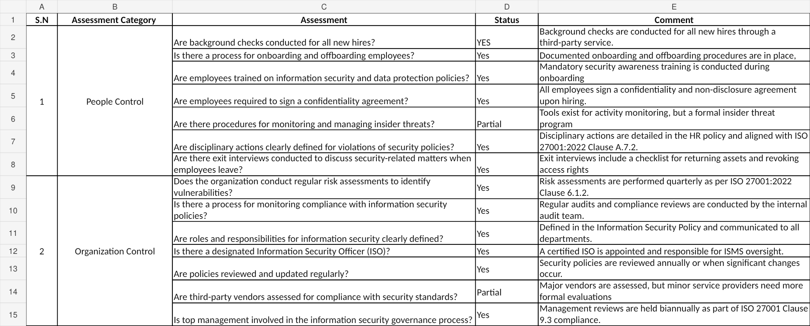
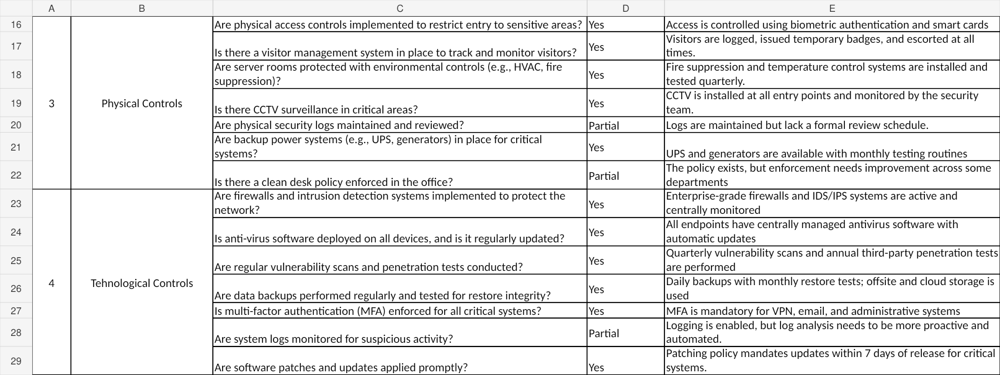
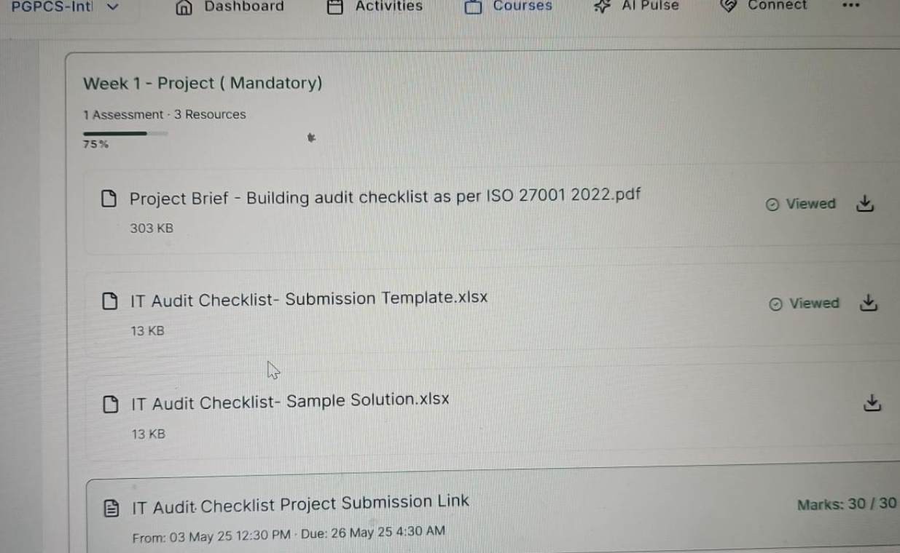

# IT Audit & GRC Risk Assessment

**Project completed:** 2025  
**Published to GitHub portfolio:** 2026  
**Assessment result:** 30/30

## 🔎 Project Overview

This project demonstrates practical experience in IT auditing, Governance, Risk and Compliance (GRC), cybersecurity risk assessment, and security-control evaluation.

The assessment reviewed **28 security controls** across four key domains:

- People Controls
- Organizational Controls
- Physical Controls
- Technological Controls

The objective was to identify implemented controls, highlight partially implemented controls, document security gaps, and recommend practical improvements.

This project was completed as part of my Postgraduate Program in Cyber Security.

---

## 🎯 Project Objectives

- Evaluate information-security controls
- Identify cybersecurity risks and control gaps
- Assess governance and compliance practices
- Review employee-related security controls
- Evaluate physical-security safeguards
- Assess technological and network-security controls
- Review access-control and authentication practices
- Examine vulnerability and patch-management processes
- Assess security monitoring and logging
- Develop recommendations for identified weaknesses

---

## 📋 Audit Scope

### 👥 People Controls

The assessment reviewed:

- Employee background checks
- Employee onboarding and offboarding
- Security-awareness training
- Confidentiality agreements
- Insider-threat management
- Security-policy disciplinary procedures
- Employee exit procedures

**Key finding:**  
Most People Controls were implemented, while insider-threat management required further formalization.

---

### 🏢 Organizational Controls

The assessment reviewed:

- Cybersecurity risk assessments
- Security-policy compliance
- Information-security roles and responsibilities
- Information Security Officer responsibilities
- Security-policy reviews
- Third-party vendor assessments
- Management involvement in security governance

**Key finding:**  
Most organizational controls were implemented. Third-party security assessments required stronger and more consistent coverage across service providers.

---

### 🔐 Physical Controls

The assessment reviewed:

- Restricted access to sensitive areas
- Visitor-management procedures
- Server-room environmental controls
- CCTV monitoring
- Physical-security logs
- Backup power systems
- Clean-desk policy

**Key findings:**

- Physical-security logs existed but required a formal review schedule.
- Clean-desk policy enforcement required improvement.

---

### 💻 Technological Controls

The assessment reviewed:

- Firewalls
- IDS/IPS
- Endpoint antivirus protection
- Vulnerability scanning
- Penetration testing
- Backup and recovery
- Multi-factor authentication
- Security logging
- Patch management

**Key finding:**  
Security logging was enabled, but monitoring and analysis required more proactive and automated processes.

---

## 📊 Assessment Summary

A total of **28 security controls** were assessed.

| Assessment Status | Controls |
|---|---:|
| Implemented | 23 |
| Partially Implemented | 5 |
| Total Controls Assessed | 28 |

Approximately **82% of the controls were fully implemented**, while approximately **18% required additional improvement or formalization**.

---

## ⚠️ Key Findings

### 1. Insider-Threat Management

A formal insider-threat management program required further development.

**Recommended improvement:**  
Establish documented insider-threat monitoring, investigation, escalation, and review procedures.

### 2. Third-Party Risk Management

Security assessments were not consistently applied across all third-party service providers.

**Recommended improvement:**  
Introduce a standardized vendor risk-assessment process based on access, data exposure, and business criticality.

### 3. Physical-Security Log Reviews

Physical-security logs were maintained but lacked a formal review schedule.

**Recommended improvement:**  
Introduce scheduled reviews with clear ownership and escalation procedures.

### 4. Clean-Desk Policy Enforcement

The clean-desk policy existed but required stronger enforcement.

**Recommended improvement:**  
Use staff awareness, periodic compliance checks, and management oversight.

### 5. Security-Log Analysis

Security logging was enabled, but analysis required greater automation and proactive monitoring.

**Recommended improvement:**  
Improve centralized log monitoring, alerting, correlation, and SIEM-based analysis.

---

## 🛡️ Security Strengths Identified

The assessment identified several implemented security practices, including:

- Employee background checks
- Security-awareness training
- Formal onboarding and offboarding
- Cybersecurity risk assessments
- Defined information-security responsibilities
- Management involvement in security governance
- Physical access controls
- Visitor-management procedures
- CCTV monitoring
- Backup power systems
- Enterprise firewalls
- IDS/IPS
- Endpoint antivirus
- Vulnerability scanning
- Penetration testing
- Data backup and recovery
- Multi-factor authentication
- Patch management

---

## 💡 Priority Recommendations

Based on the assessment, the main priorities were:

1. Formalize the insider-threat management program.
2. Strengthen third-party risk assessment.
3. Introduce scheduled physical-security log reviews.
4. Improve clean-desk policy enforcement.
5. Increase automation of security-log monitoring and analysis.

---

## 🧠 Skills Demonstrated

- Governance, Risk & Compliance (GRC)
- IT Auditing
- Cybersecurity Risk Assessment
- Security Control Assessment
- ISO 27001 Concepts
- Information Security Governance
- Third-Party Risk Management
- Access Control
- Physical Security
- Network Security
- Vulnerability Management
- Security Monitoring
- Patch Management
- Audit Documentation
- Risk Identification
- Control-Gap Analysis
- Remediation Recommendations

---

## 📈 Key Takeaways

This project demonstrated that effective cybersecurity requires more than technical security tools.

A mature security program requires coordination between:

- People
- Policies
- Governance
- Physical security
- Technology
- Risk management
- Security monitoring

The assessment strengthened my ability to identify control weaknesses, evaluate cybersecurity risks, and translate audit findings into practical security recommendations.

## 📸 Project Screenshots

### 1. People & Organizational Controls

### 2. Physical & Technological Controls

### 3. Assessment Result — 30/30

---

---
## 📄 Project Evidence

The completed IT Audit Checklist is included in this repository as supporting evidence.

[📊 View IT Audit Checklist](IT%20Audit%20Checklist..xlsx)

**Assessment result:** 30/30

[🏆 View Assessment Result](screenshots/03-assessment-result-30-of-30.png)

---
---

## 👨‍💻 Author

**Benard Obi Kekong**

Cybersecurity Analyst | CompTIA Security+ | SOC & GRC | Microsoft Sentinel | SIEM | Risk Assessment | Python
